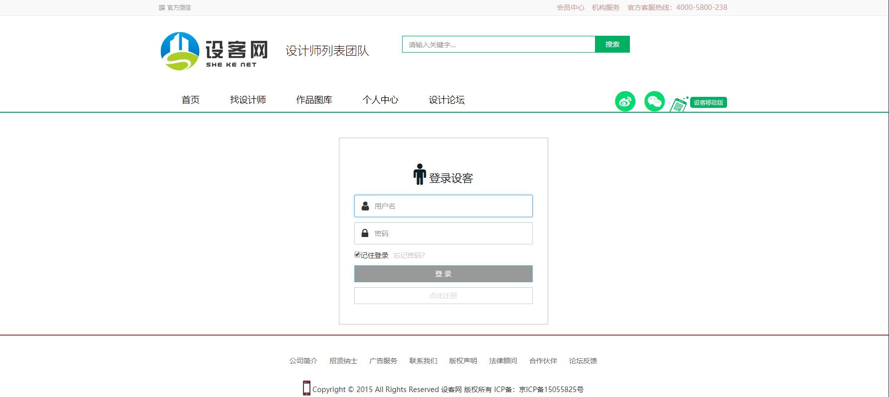

[目录]

<!-- TOC -->

- [Zoomla!逐浪CMS卓越出品](#zoomla逐浪cms卓越出品)
  - [逐浪官方开源精品全站项目022：设客网设计师与设计院作品分享与威客交易门户网站](#逐浪官方开源精品全站项目022-设客网设计师与设计院作品分享与威客交易门户网站)
  - [本项目介绍](#本项目介绍)
- [开放性说明](#开放性说明)
  - [使用说明](#使用说明)
- [接口文档](#接口文档)
  - [ZoomlaCLI-Studio接口使用说明](#zoomlacli-studio接口使用说明)
  - [本程序目录结构](#本程序目录结构)
- [系统运行效果图](#系统运行效果图)

<!-- /TOC -->


<p align="center">
  <a href="http://www.z01.com/">
    
  </a>
</p>
<br>


# Zoomla!逐浪CMS卓越出品

## 逐浪官方开源精品全站项目022：-设客网设计师与设计院作品分享与威客交易门户网站


Zoomla!逐浪CMS：中文业界alexa排名第一的CMS系统|专注.net与windows平台企业级研发，集成内容管理、webfont、商城、店铺、黄页、教育、考试、3D、三维全景、混合现实、CRM、ERP、OA、论坛、贴吧等为一体，打造国内高端的CMS产品典范。

官网：www.z01.com

免费下载：www.z01.com/mb

视频教程：www.z01.com/mtv

模板资源：www.z01.com/mb

逐浪字库： http://f.ziti163.com

zico中文图标库：http://ico.z01.com


QQ交流群号：
[](https://jq.qq.com/?_wv=1027&k=5qIayyX)  [](https://jq.qq.com/?_wv=1027&k=5Ephzpq)   [](https://jq.qq.com/?_wv=1027&k=50a28BK) 


官方QQ客服：
[](http://wpa.qq.com/msgrd?v=3&uin=745151353&site=qq&menu=yes)  [](http://wpa.qq.com/msgrd?v=3&uin=1799661890&site=qq&menu=yes) 

## 本项目介绍

这是一个-针对建筑设计行业平台网站，建立设计师、设计院、开发商之间的信息沟通、业务交互、协调设计平台，为设计师创业提供项目、技术、人员及服务支持，为设计院提供项目分包及人力资源支持。，其特征包括：
- 服务端基于Zoomla!逐浪CMS开发
- 前端web呈现基于Boostrap 
- 支持chrome和现代化浏览器，兼容IE11与EDGE浏览器
- 多角色用户，分为设计师与设计院、开发商等，
- 集成在线支付，可在线托管费用寻找设计师。
- 手机注册获得验证，提交企业、设计师使命认证。
- 发布需求，在线参与投标；
- 提交设计访方案等


# 开放性说明
本项目基于Zoomla!逐浪CMS接口与VueCLI结合开发，如果您不需要其中的远程提交表单（访客留言）则可以单独编译，忽略逐浪CMS接口部份，依然可以正常运行，非常方便。
有道是：

- 建网站,选逐浪。
- 易上手,功能棒。
- 质量好,服务善。
- 高性能,最划算。

## 使用说明

- 1.后台路径：/admin/login.aspx
- 2.脚本框架：.net 4.0 集成模式（即IIS进程池应选为集成模式）。
- 3.数据库：MSSQL 2005(推荐使用MSSQL2016)
- 4.最低操作系统：windows server 2003
- 5.根目录下data.bak为数据库还原文件，还原即可。
- 6.`/config/ConnectionStrings.config`为数据库配置连接。
- 7.`/Template`为模板配置目录，在此配置模板即可。
- 8.后台超级管理员默认帐号名为：`admin`，密码：`admin888`，如果登录不上，请在数据库上执行下面语法即可恢复初始`admin888`密码：
```
update zl_manager set adminpassword='7fef6171469e80d32c0559f88b377245' where adminid=1  --重设后台admin密码为admin888
```
- 9.在win2016、win10、win 2019等系统部署，请注意web.config中删除
```
<mimeMap fileExtension=".woff2" mimeType="font/x-woff" />
```


# 接口文档
## ZoomlaCLI-Studio接口使用说明
 [ZoomlaCLI-Studio接口使用说明](源码与接口使用说明/ZoomlaCLI-Studio接口使用说明.md)
## 本程序目录结构
 [本程序目录结构](源码与接口使用说明/本程序目录结构.md)

# 系统运行效果图





